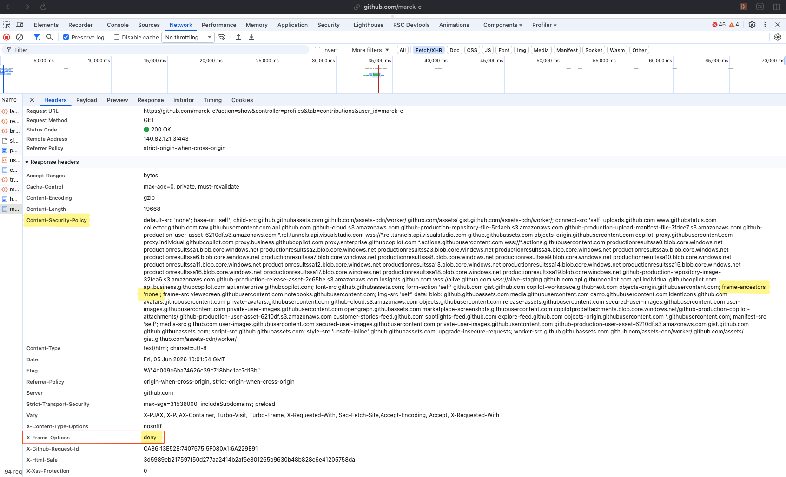

# Defense #1 - X-Frame-Options

<div class="grid grid-cols-2 gap-6 mt-2">

<div>

**The original header** (2009, legacy but still useful) [MDN docs ↗](https://developer.mozilla.org/en-US/docs/Web/HTTP/Headers/X-Frame-Options)

```http
# Block all framing - strongest
X-Frame-Options: DENY

# Allow same origin only
X-Frame-Options: SAMEORIGIN

# Specific origin - deprecated, not in Chrome
X-Frame-Options: ALLOW-FROM https://trusted.com
```

Server configuration:

```nginx
# Nginx
add_header X-Frame-Options "DENY" always;
```

```python
# Django (settings.py)
X_FRAME_OPTIONS = 'DENY'
```

```java
// Spring Security
http.headers().frameOptions().deny();
```

</div>

<div v-click>

**Limitations:**
- `ALLOW-FROM` not supported in Chrome, Safari
- Cannot specify **multiple** allowed origins
- `SAMEORIGIN` still allows framing from any same-origin page - an XSS or user-controlled page on your own domain is enough
- Being superseded by CSP `frame-ancestors`

**Still recommended** as defense-in-depth alongside CSP. Universally understood by browsers, zero-cost to add.

<Callout variant="warning" class="mt-4">Missing on <strong>~63%</strong> of production sites — <a href="https://almanac.httparchive.org/en/2024/security" target="_blank">HTTP Archive Web Almanac 2024</a></Callout>

</div>

</div>

---
zoom: 0.9
---

# Defense #2 - CSP `frame-ancestors`

<InfoPopover title="What is CSP?" width="620px" x="4.5rem" y="5.5rem">
  <p><strong>Content Security Policy</strong> is an HTTP response header that lets a server declare which sources are trusted for loading resources — scripts, styles, images, and frames.</p>
  <div class="ip-code">Content-Security-Policy: &lt;directive&gt; &lt;sources&gt;; &lt;directive&gt; &lt;sources&gt;;</div>
  <p style="margin-top:8px">Most common use: <strong>blocking XSS</strong> by restricting where scripts can load from:</p>
  <div class="ip-code">script-src 'self' https://cdn.example.com;</div>
  <p style="margin-top:8px">This blocks inline scripts and untrusted origins — cutting off the most common XSS vectors.<br><br>
  <code>frame-ancestors</code> is a separate directive controlling who can embed your page in an <code>&lt;iframe&gt;</code>.</p>
</InfoPopover>

<div class="grid grid-cols-2 gap-6 mt-2">

<div>

**The modern standard** (recommended over XFO) [MDN docs ↗](https://developer.mozilla.org/en-US/docs/Web/HTTP/Headers/Content-Security-Policy/frame-ancestors)

```http
# Block all framing
Content-Security-Policy: frame-ancestors 'none';

# Allow same origin only
Content-Security-Policy: frame-ancestors 'self';

# Allowlist specific origins
Content-Security-Policy: frame-ancestors
  'self'
  https://trusted-partner.com
  https://embed.example.com;
```

<Callout variant="warning" class="mt-4">Missing on <strong>~89%</strong> of production sites — <a href="https://almanac.httparchive.org/en/2024/security" target="_blank">HTTP Archive Web Almanac 2024</a></Callout>

</div>

<div v-click>

**CSP vs X-Frame-Options:**

| Feature | XFO | CSP |
|---------|:---:|:---:|
| Multi-origin allowlist | ❌ | ✅ |
| Wildcard subdomains | ❌ | ✅ |
| Report-only mode | ❌ | ✅ |

**Best practice: set both** for maximum compatibility:

```http
X-Frame-Options: DENY
Content-Security-Policy: frame-ancestors 'none';
```

If they conflict, CSP `frame-ancestors` takes precedence in modern browsers.

</div>

</div>

<style>
.ip-code {
  font-family: monospace;
  font-size: 1em;
  background: var(--cj-divider);
  border: 1px solid var(--cj-border);
  border-radius: 6px;
  padding: 6px 8px;
  margin-top: 6px;
  color: var(--cj-defense-text);
  word-break: break-all;
}
.ip-body code {
  background: var(--cj-divider);
  padding: 1px 5px;
  border-radius: 4px;
}
.ip-body p { margin: 0; }
</style>

---
zoom: 0.95
---
# JavaScript Framebusting

<Callout variant="note" class="mt-2 mb-3">Before HTTP headers existed for this, developers wrote client-side JS to detect iframe nesting and force the top window to navigate away. It was the best available option in 2008, broken almost immediately after.</Callout>

<div class="grid grid-cols-2 gap-6 mt-2">

<div>

**Classic approach** (fragile, do not rely on)

```js
// The classic framebusting script
if (window.top !== window.self) {
  window.top.location = window.self.location
}

// More aggressive variant
if (window !== top) {
  document.body.style.display = 'none'
  top.location.replace(location.href)
}
```

</div>

<div v-click>

**The bypass:** HTML5 `sandbox` attribute

```html
<!-- Attacker disables top-navigation -->
<iframe
  src="https://bank.com/transfer"
  sandbox="allow-forms allow-scripts">
  <!--        ↑ allow-top-navigation is ABSENT -->
  <!-- JS framebusting can't redirect anymore! -->
</iframe>
```

**Other bypass vectors:**
- `onbeforeunload` event listener to cancel navigation

<Callout variant="error" class="mt-3">JS framebusting is unreliable. Use HTTP headers only.</Callout>

</div>

</div>

---
zoom: 0.9
---

# Defenses in Action

<InfoPopover title="GitHub's actual response headers" width="700px" x="4.5rem" y="5.5rem">
  
</InfoPopover>

<div class="dia-label">Trying to embed <code>github.com</code> in an iframe —> live, right now</div>

<div class="dia-frame">
  <iframe src="https://github.com" style="width:100%;height:100%;border:none;display:block;"></iframe>
</div>

<div class="dia-footer">
  <code class="dia-badge">X-Frame-Options: DENY</code>
  <span class="dia-msg">GitHub sends this on every response. The browser won't load the frame, so the attacker's overlay is useless before it even starts.</span>
</div>

<style>
.dia-label {
  font-size: 0.84em;
  color: var(--cj-text-muted);
  margin-bottom: 12px;
}
.dia-label code {
  background: var(--cj-divider);
  padding: 1px 6px;
  border-radius: 4px;
  color: var(--cj-text);
}
.dia-frame {
  border: 2px solid var(--cj-safe-border);
  border-radius: 10px;
  overflow: hidden;
  height: 300px;
  background: var(--cj-surface);
}
.dia-footer {
  margin-top: 14px;
  display: flex;
  align-items: center;
  gap: 12px;
}
.dia-badge {
  font-family: monospace;
  font-size: 0.78em;
  background: var(--cj-safe-bg);
  color: var(--cj-safe-text);
  border: 1.5px solid var(--cj-safe-border);
  padding: 5px 12px;
  border-radius: 6px;
  white-space: nowrap;
  flex-shrink: 0;
}
.dia-msg {
  font-size: 0.82em;
  color: var(--cj-text);
  line-height: 1.5;
}
.ip-img {
  display: block;
  width: 100%;
  margin-top: 8px;
  border-radius: 6px;
  border: 1px solid var(--cj-border);
}
</style>

---
class: px-14 py-6
hide: true
zoom: 0.9
---

# Clickjacking vs CSRF - Not the Same Thing

<div class="csrf-intro mt-3">
  Both attacks exploit an authenticated session, but the mechanism is different, and so are the defenses. Knowing the difference matters because <strong>fixing one does not fix the other.</strong>
</div>

<div class="csrf-grid mt-4">

  <div class="csrf-card" v-click>
    <div class="csrf-card-label csrf-label--blue">CSRF - Cross-Site Request Forgery</div>
    <div class="csrf-card-body">
      <div class="csrf-row">
        <span class="csrf-key">How</span>
        <span>Hidden request fires automatically via an <code>&lt;img&gt;</code>, a <code>&lt;form&gt;</code>, or a <code>fetch()</code> on an attacker page the victim merely <em>visits</em></span>
      </div>
      <div class="csrf-row">
        <span class="csrf-key">Interaction</span>
        <span>None needed. The victim doesn't have to click anything.</span>
      </div>
      <div class="csrf-row">
        <span class="csrf-key">Victim sees</span>
        <span>Nothing; the attack is invisible</span>
      </div>
      <div class="csrf-row">
        <span class="csrf-key">Stopped by</span>
        <span>✅ CSRF tokens &nbsp;·&nbsp; ✅ SameSite cookies &nbsp;·&nbsp; ✅ Origin/Referer checks</span>
      </div>
    </div>
  </div>

  <div class="csrf-card" v-click>
    <div class="csrf-card-label csrf-label--red">Clickjacking - UI Redressing</div>
    <div class="csrf-card-body">
      <div class="csrf-row">
        <span class="csrf-key">How</span>
        <span>The victim <em>actually clicks</em> on a real button, in a real authenticated page, inside an invisible iframe overlay</span>
      </div>
      <div class="csrf-row">
        <span class="csrf-key">Interaction</span>
        <span>Required. The victim must physically click.</span>
      </div>
      <div class="csrf-row">
        <span class="csrf-key">Victim sees</span>
        <span>A decoy page; they think they're clicking something harmless</span>
      </div>
      <div class="csrf-row">
        <span class="csrf-key">Stopped by</span>
        <span>❌ CSRF tokens (useless) &nbsp;·&nbsp; ✅ Frame headers &nbsp;·&nbsp; ✅ SameSite cookies</span>
      </div>
    </div>
  </div>

</div>

<Callout v-click variant="warning" class="mt-3"><strong>The dangerous misconception:</strong> "We have CSRF tokens, we're safe." With clickjacking the victim clicks a real button in a real session. The CSRF token is legitimately present and valid. The server cannot tell it was a tricked click. Frame headers are the only fix.</Callout>

<style>
.csrf-intro { font-size: 0.84em; color: var(--cj-text); line-height: 1.5; }

.csrf-grid {
  display: grid;
  grid-template-columns: 1fr 1fr;
  gap: 14px;
}

.csrf-card {
  border-radius: 14px;
  overflow: hidden;
  border: 1.5px solid var(--cj-border);
  animation: csrf-rise 340ms cubic-bezier(0.22, 1, 0.36, 1) both;
}
.csrf-card.slidev-vclick-hidden { animation-play-state: paused; }

.csrf-card-label {
  font-size: 0.72em;
  font-weight: 800;
  text-transform: uppercase;
  letter-spacing: 0.4px;
  padding: 6px 14px;
}
.csrf-label--blue { background: var(--cj-defense-bg); color: var(--cj-defense-text); border-bottom: 1px solid var(--cj-defense-border); }
.csrf-label--red  { background: var(--cj-danger-bg); color: var(--cj-danger-text); border-bottom: 1px solid var(--cj-danger-border); }

.csrf-card-body {
  padding: 10px 14px;
  display: flex;
  flex-direction: column;
  gap: 7px;
  background: #fff;
}

.csrf-row {
  display: flex;
  gap: 10px;
  font-size: 0.74em;
  color: var(--cj-text);
  line-height: 1.4;
}
.csrf-key {
  font-weight: 800;
  color: var(--cj-text-muted);
  min-width: 72px;
  flex-shrink: 0;
  padding-top: 1px;
}

</style>

