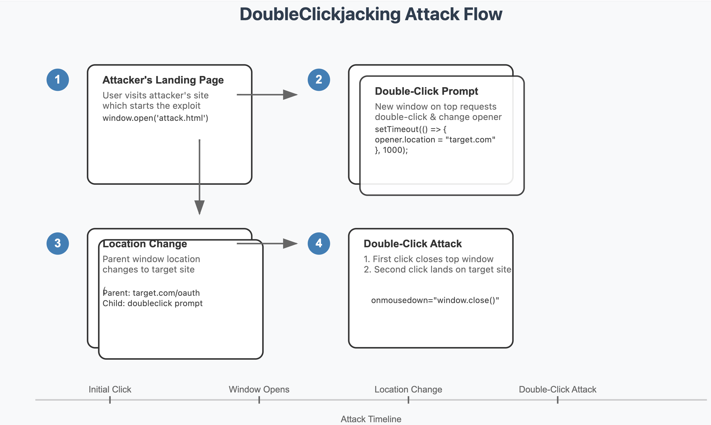

# DoubleClickjacking — No iframe Required

<span class="dcj-badge">2024 · Paulos Yibelo</span> <a href="https://www.evil.blog/2024/12/doubleclickjacking-what.html" target="_blank" class="dcj-link">evil.blog ↗</a>

<Callout variant="warning" class="mt-4">You set <code>X-Frame-Options: DENY</code> on every page. Doesn't matter. <strong>No iframe is involved.</strong></Callout>

<div class="dcj-three-col mt-6">
  <OffsetCard title="Classic Clickjacking" accent="blue">
    <template #icon>🖼️</template>
    Loads victim in an invisible <code>iframe</code>. Blocked by <code>X-Frame-Options</code> and <code>CSP frame-ancestors</code>.
  </OffsetCard>
  <OffsetCard title="DoubleClickjacking" accent="red">
    <template #icon>🖱️</template>
    Uses a <strong>popup window</strong> and the <code>window.opener</code> API. Zero iframes. All frame-based defenses are blind to it.
  </OffsetCard>
  <OffsetCard title="What's Bypassed" accent="orange">
    <template #icon>🚫</template>
    <code>X-Frame-Options</code> · <code>CSP frame-ancestors</code> · <code>SameSite</code> cookies (Lax &amp; Strict)
  </OffsetCard>
</div>

<style>
.dcj-badge {
  display: inline-block;
  padding: 3px 12px;
  border-radius: 999px;
  background: var(--mm-danger-bg);
  color: var(--mm-danger-text);
  border: 1px solid var(--mm-danger-border);
  font-size: 0.72em;
  font-weight: 700;
  letter-spacing: 0.3px;
}
.dcj-three-col {
  display: grid;
  grid-template-columns: repeat(3, 1fr);
  gap: 20px;
}
.dcj-link {
  font-size: 0.72em;
  font-weight: 700;
  color: var(--mm-danger-text);
  text-decoration: none;
  opacity: 0.75;
  margin-left: 6px;
}
.dcj-link:hover { opacity: 1; }
</style>

---
class: px-14 py-4
---

# How It Works — The Timing Trick

<div class="grid grid-cols-2 gap-6 mt-4">

<div class="dcj-steps">
  <div class="dcj-step">
    <div class="dcj-step-num">01</div>
    <div>
      <div class="dcj-step-title">Attacker serves a popup</div>
      <div class="dcj-step-desc">A decoy popup opens asking the victim to <strong>"double-click to verify you're human."</strong> The popup holds <code>window.opener</code> — a reference back to the parent tab.</div>
    </div>
  </div>

  <div class="dcj-step">
    <div class="dcj-step-num">02</div>
    <div>
      <div class="dcj-step-title"><code>mousedown</code> fires — parent tab swaps silently</div>
      <div class="dcj-step-desc">On the <em>first press</em> of the double-click, <code>mousedown</code> fires immediately. The popup redirects the parent tab to a real OAuth consent screen via <code>window.opener.location</code>.</div>
    </div>
  </div>

  <div class="dcj-step dcj-step--red">
    <div class="dcj-step-num">03</div>
    <div>
      <div class="dcj-step-title"><code>mouseup</code> lands on the OAuth "Allow" button</div>
      <div class="dcj-step-desc">By the time the click completes, the consent screen has loaded with "Allow" exactly under the cursor. The victim just authorized the attacker's app.</div>
    </div>
  </div>
</div>

<div v-click>

```js
// popup.html — the "double-click to verify" decoy
document.querySelector('.verify-btn')
  .addEventListener('mousedown', () => {

    // Fires on first press — before mouseup completes
    window.opener.location =
      'https://slack.com/oauth/v2/authorize' +
      '?client_id=HACKER_APP' +
      '&scope=chat:write,users:read,channels:read'

    // mouseup now fires on the OAuth "Allow" button
    // in the parent tab — authorizing the attacker's app
  })
```

<Callout variant="note" noIcon class="mt-3">The entire swap happens in the ~100 ms gap between press and release — imperceptible to humans, reliable for scripts.</Callout>

</div>

</div>

<style>
.dcj-steps { display: flex; flex-direction: column; gap: 10px; }

.dcj-step {
  display: flex;
  gap: 14px;
  align-items: flex-start;
  padding: 12px 16px;
  background: var(--mm-surface);
  border: 1px solid var(--mm-border);
  border-radius: 12px;
}
.dcj-step--red { background: var(--mm-danger-bg); border-color: var(--mm-danger-border); }

.dcj-step-num {
  font-size: 1.8em;
  font-weight: 900;
  color: var(--mm-text-strong);
  line-height: 1;
  min-width: 2.2rem;
  text-align: center;
}
.dcj-step-title { font-size: 0.84em; font-weight: 800; color: var(--mm-text-strong); margin-bottom: 3px; }
.dcj-step-desc  { font-size: 0.76em; color: var(--mm-text-muted); line-height: 1.45; }
</style>

---
layout: two-cols
class: p-2 py-4
---

<div style="display:flex; align-items:center; justify-content:center; height:100%;">

</div>
::right::

<div style="display:flex; align-items:center; justify-content:center; height:100%;">
  <video src="../public/dcj-demo.mp4" controls autoplay loop muted style="width:100%; border-radius:12px; box-shadow: 0 8px 32px rgba(0,0,0,0.10);" />
</div>

---
layout: center
---

## Demo — OAuth Hijack via Double-Click

<div class="dcj-demo-btns">
  <button class="dcj-demo-btn" onclick="window.open('/clickjacking/victims/dcj-victim.html','_blank','popup=yes,width=900,height=580,left=150,top=80')">
    <span class="i-lucide-play" style="width: 20px; height: 20px;"></span>Launch Demo
  </button>
  <button class="dcj-demo-btn dcj-demo-btn--real" onclick="window.open('/clickjacking/victims/dcj-victim.html?real=1','_blank','popup=yes,width=900,height=580,left=150,top=80')">
    <span class="i-lucide-external-link" style="width: 20px; height: 20px;"></span>Real Target
  </button>
</div>

<p class="dcj-demo-note">Live demo uses a fake Slack consent screen. <strong>Real Target</strong> hits GitHub OAuth — register your app with callback <code>https://presentations.melmayan.fr/clickjacking/callback/</code> and set <code>VITE_GITHUB_OAUTH_CLIENT_ID</code> in deploy env (see <code>.env.example</code>). Don't click Authorize on stage.</p>

<div v-click class="dcj-revoke-wrap">
  <a
    href="https://github.com/settings/applications"
    target="_blank"
    rel="noopener noreferrer"
    class="dcj-revoke-btn"
  >
    <span class="i-lucide-shield-off" style="width: 18px; height: 18px;"></span>
    Revoke authorized OAuth apps
  </a>
</div>

<style>
.dcj-demo-btns {
  display: flex;
  flex-wrap: wrap;
  align-items: center;
  justify-content: center;
  gap: 12px;
  margin-top: 24px;
}
.dcj-demo-btn {
  display: flex;
  align-items: center;
  justify-content: center;
  gap: 10px;
  width: fit-content;
  padding: 14px 32px;
  background: var(--mm-danger);
  color: #ffffff;
  font-size: 1.05em;
  font-weight: 800;
  border-radius: 10px;
  border: none;
  cursor: pointer;
  transition: opacity 0.15s;
  box-shadow: 0 6px 24px rgba(220,38,38,0.30);
}
.dcj-demo-btn--real {
  background: #1a1a1a;
  box-shadow: 0 6px 24px rgba(0,0,0,0.18);
}
.dcj-demo-btn:hover { opacity: 0.88; }
.dcj-demo-note {
  margin: 16px auto 0;
  max-width: 520px;
  font-size: 0.78em;
  color: var(--mm-text-muted);
  text-align: center;
  line-height: 1.5;
}
.dcj-revoke-wrap {
  display: flex;
  justify-content: center;
  margin-top: 20px;
}
.dcj-revoke-btn {
  display: inline-flex;
  align-items: center;
  gap: 8px;
  padding: 11px 22px;
  background: #fff;
  color: var(--mm-text-strong);
  border: 1px solid var(--mm-border);
  border-radius: 10px;
  font-size: 0.82em;
  font-weight: 700;
  text-decoration: none;
  box-shadow: 0 2px 12px rgba(0,0,0,0.06);
  transition: border-color 0.15s, box-shadow 0.15s;
}
.dcj-revoke-btn:hover {
  border-color: var(--mm-danger-border);
  box-shadow: 0 4px 16px rgba(220,38,38,0.12);
}
</style>

<!--
PRESENTER NOTE:
Ask the audience: "What do you think you're double-clicking?"

Launch Demo — reliable stage demo. Double-click the fake Turnstile button;
popup closes on mousedown, mouseup hits the fake Slack Allow button.

Real Target — live Cloudflare Turnstile + window.opener.location swap to your
GitHub OAuth app (.env). Needs network. Double-click "Double-click to verify"
below the widget. Parent shows real GitHub login or consent — do NOT click
Authorize. Use the video for a full hit.
-->

---
zoom: 0.78
---

# Mitigation Strategies

<div class="grid grid-cols-2 gap-6 mt-4">

<div>

**Client-Side Protection**

Disable critical buttons until a real user gesture is detected:

```js
// Only applies to pointer devices — touch can't do DCJ
if (window.matchMedia("(hover: hover)").matches) {
  const buttons = document.querySelectorAll(
    'form button, form input[type="submit"]'
  );

  // Disabled on load — blocks the phantom double-click 🛑
  buttons.forEach(btn => (btn.disabled = true));

  function enableButtons() {
    buttons.forEach(btn => (btn.disabled = false));
    document.removeEventListener("mousemove", enableButtons);
  }

  // Re-enable only after real user interaction
  document.addEventListener("mousemove", enableButtons);
  document.addEventListener("keydown", e => {
    if (e.key === "Tab") enableButtons();
  });
}
```

Zero UX impact ➡️ activation happens well before the user reaches the button

</div>

<div>

**Long-Term: Browser Standards**

The pattern mirrors the 2008 clickjacking story. JS patches first, then browser-level headers. Example of future proposals:

| Idea | What it does |
|------|-------------|
| `Double-Click-Protection: strict` | Block rapid context-switching between windows mid-double-click |
| CSP extension | Expand `frame-ancestors`-style policy to cover opener/popup scenarios |

<Callout v-click variant="purple" class="mt-5" icon="💡">

<strong>Where else does this pattern live?</strong> Anywhere the <em>terminating</em> event of a gesture fires the action on whatever page is underneath:

<ul class="dcj-similar-list">
  <li><strong>Mobile double-tap</strong> — <code>touchstart</code> → swap → <code>touchend</code> synthesizes the click on whatever's under the finger when released.</li>
  <li><strong>Cross-origin drag-and-drop</strong> — <code>dragstart</code> → swap → <code>drop</code> lands a file or text payload on a swapped drop zone.</li>
  <li><strong>Spacebar on a focused button</strong> — Space fires <code>click</code> only on <code>keyup</code>, so <code>keydown</code> → swap → <code>keyup</code> activates whatever button is focused on the new page.</li>
</ul>

</Callout>

<style>
.dcj-similar-list {
  margin: 8px 0 6px;
  padding-left: 1.1em;
  list-style: disc;
}
.dcj-similar-list li { margin: 4px 0; line-height: 1.5; }
.dcj-similar-list li + li { margin-top: 6px; }
.callout p { margin: 0; }
</style>
</div>

</div>
