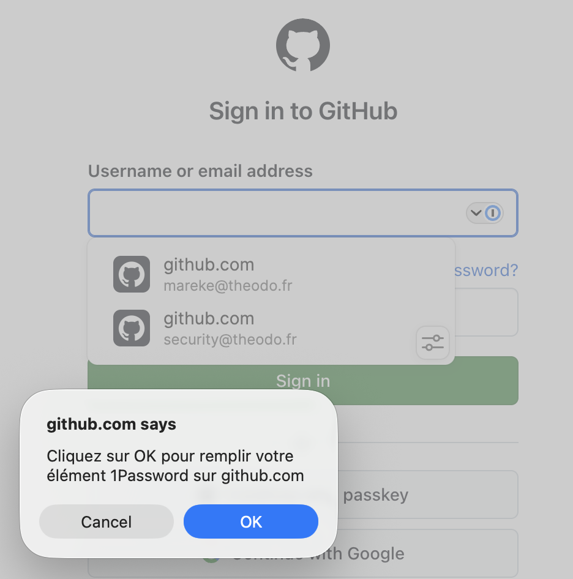

# DOM-Based Extension Clickjacking

Marek Toth <a href="https://marektoth.com/blog/dom-based-extension-clickjacking/" target="_blank" class="ecj-link">marektoth.com/blog ↗</a>

Classic clickjacking hides another website. This hides <strong style="color:var(--mm-text-strong)">your password manager</strong>. A much better target.

  

    
Classic Clickjacking

    
Attacker loads <code>bank.com</code> in an invisible <code>iframe</code> and overlays a fake button on top.

    
iframe { opacity: 0.001; z-index: 10; }

  

  
vs

  

    
Extension Clickjacking

    
Malicious script hides the extension's injected autofill UI, then overlays a fake "Accept Cookies" banner on top.

    
document.querySelector('.pm-autofill') .style.opacity = '0'

  

  
Why password managers are the ideal target

  

    

      
Scope

      
One vault is the master key. Logins, TOTP, cards, and notes for every account, all in one place.

    

    

      
Reach

      
The extension injects its UI into <em>every</em> page you load, so there's always something on-screen to hijack, with no special target site required.

    

    

      
Trigger

      
<strong>Manual autofill</strong> fills credentials when the user selects from the extension's dropdown UI. That selection click is exactly what we hijack.

    

  

  

    ⚠ <strong>Automatic autofill</strong> (0-click, mostly browsers) is a separate threat: credentials injected on page load with no interaction at all.
    <a href="https://marektoth.com/blog/password-managers-autofill/#abuse-autofill" target="_blank" style="color:var(--mm-danger-text);margin-left:4px;">Research: <em>You should disable autofill in your password manager</em> (2021) ↗</a>
  

<!--
PRESENTER NOTE:
Reframe the threat: the victim site isn't in a frame. Your password manager's injected UI is.
Attacker page runs JS that sets opacity:0 on the extension popup, overlays a cookie banner.

[click] Why password managers specifically?
- Scope: one vault = all accounts. Classic CJ gives you one action on one site. This gives you the master key.
- Reach: the extension injects its UI on every page, so there's always something to hijack. (What that gets you depends on the tier - cards/IDs from any page, logins only with code on the target origin. We scope this on the "Some Loot Is Free" slide.)
- Trigger: we're talking manual autofill. The user clicks to pick credentials from the extension's dropdown UI, and THAT click is what we hijack. (Automatic autofill, 0-click, browser fills on page load, is a separate threat covered in 2021 research; link in the footnote.)

[click] No iframe, no CORS, no frame headers. Any page with a malicious third-party script can do this.
One line of JS on a compromised ad network = game over for autofill.
-->

---
zoom: 0.92
---

# The Page Owns Every Pixel the Extension Draws

  A password manager has no window of its own. To show its autofill dropdown, it <strong>injects HTML straight into the page you're visiting</strong>. From that moment the page's own JavaScript can read, restyle, and hide it like any other element.

  

    
1

    
Extension injects its UI

    
A content script adds the autofill dropdown into the page DOM.

    
&lt;pm-autofill&gt; … &lt;/pm-autofill&gt;

  

  
→

  

    
2

    
The page grabs it

    
Same DOM, no wall between them. One selector finds the node.

    
document.querySelector('pm-autofill')

  

  
→

  

    
3

    
…and makes it vanish

    
Invisible to you, but still sitting there, still fully clickable.

    
.style.opacity = '0'

  

<Callout v-click variant="error" class="mt-6" noIcon>
  No iframe is loaded, so <code>X-Frame-Options</code> and <code>frame-ancestors</code> never fire. The browser just sees a page quietly restyling its own contents.
</Callout>

<!--
PRESENTER NOTE:
This is the whole "how is this even possible" beat. Keep it concrete.
The extension can't draw outside the page - it has no OS window for the dropdown, so it injects DOM into your page.
[click] Once it's a DOM node, it's the page's DOM. The site's JS (or any third-party script the site loads) can querySelector it.
[click] One line sets opacity:0. The element is invisible but unchanged - same position, same size, still receiving clicks.
[click] Hammer the headers point: there is no frame, so XFO and frame-ancestors are simply not in the conversation. Different layer entirely.
Mention in passing: same idea works by hiding the whole <body> (and painting a screenshot of the site behind it) or by laying a transparent overlay on top with pointer-events:none. Three flavors, one result.
-->

---

# One Loop Covers Every Manager

  Each manager injects its autofill UI with a <strong>unique, predictable DOM signature</strong>. The attacker doesn't need to know which one you use. They probe a list and hide the first match.

  

    
DOM signatures (by manager)

    

      
<code>[data-1p-id]</code>1Password

      
<code>#bitwarden-notification-bar</code>Bitwarden

      
<code>#dashlane-app</code>Dashlane

      
<code>[id*="keeper-fill"]</code>Keeper

      
<code>#lastpass-vault-root</code>LastPass

      
<code>[id^="nordpass"]</code>NordPass

      
<code>[id^="protonpass"]</code>Proton Pass

    

  

  

    
Attacker's detection loop

    <pre class="pmdet-pre">const SIGS = [
  '[data-1p-id]',
  '#bitwarden-notification-bar',
  '#dashlane-app',
  '[id*="keeper-fill"]',
  // … one per manager
];
const pmEl = SIGS
  .map(s => document.querySelector(s))
  .find(Boolean);
if (pmEl) pmEl.style.opacity = '0';</pre>
  

<!--
PRESENTER NOTE:
Bridge from the mechanism: the page CAN touch the extension's DOM, but which element? Different managers, different selectors.
The attacker's answer is trivial: try all of them. The detection loop is 15 lines, one selector per manager.
The first querySelector that returns a node wins. Hide it, position the decoy overlay, done.
This is why the same code path hit 11 managers: the attack is manager-agnostic. No per-manager customization needed.
The Callout lands the scale: one poisoned ad tag inherits the full 40M-user blast radius.
-->

---
class: px-14 py-4
---

# One Click on "Accept Cookies" Empties the Vault

  Everyone dismisses a cookie banner on reflex. The attacker lines that reflex up with the password manager's hidden Autofill button, so the click you meant for "Accept" lands somewhere else.

  

    
1

    
<strong>Plant a decoy form.</strong> The attacker page drops a login/card form and turns it nearly invisible with <code>opacity: 0.001</code>.

  

  

    
2

    
<strong>Wake the password manager.</strong> Script calls <code>.focus()</code> on the form → the autofill dropdown pops up, offering to fill it.

  

  

    
3

    
<strong>Hide the dropdown.</strong> Same trick as the last slide, and the Autofill button is now invisible but still live.

  

  

    
4

    
<strong>Overlay the bait.</strong> A fake "Accept all cookies" banner is positioned so <em>Accept</em> sits exactly on top of the hidden Autofill button.

  

  

    
5

    
<strong>You click Accept.</strong> The manager autofills the decoy → values stream to the attacker's server. Cards &amp; identity from any page; logins only if their script is running on your real site. You just saw a cookie banner close.

  

<!--
PRESENTER NOTE:
This is the con, told as a recipe. Walk it one click at a time.
1. Decoy form is real and on the page, just at opacity 0.001 - the manager treats it as a normal field.
2. focus() is the key move: manual autofill shows its dropdown when a field gets focus. The attacker triggers that, the user didn't.
3. Hide the dropdown with opacity/overlay - the Autofill button stays exactly where it is.
4. Alignment is the craft: the visible "Accept" button must overlap the invisible Autofill button. Cookie banner, captcha, newsletter close-X all work as bait.
[click through 5] The punchline: the user performed a completely normal action and the credentials went to the attacker. No warning, no second click.
Then: scope what this actually grabs - and what each tier costs the attacker.
-->

---
zoom: 0.92
---

# Some Loot Is Free. Logins Cost a Foothold.

  The autofill dropdown only ever offers what it would fill on <em>this</em> origin. So what an attacker walks away with depends entirely on <strong>where they already have a foothold</strong>.

  

    
Target

    
Needs a vuln on the victim's site?

    
Effort

    
Noticed?

  

  

    

      
Personal info &amp; cards

      
Name, email, address · card no. + CVV

    

    
NoneNot domain-scoped, so it fills on any attacker page.

    
1 click

    
No

  

  

    

      
Logins &amp; TOTP

      
Password + 2FA code = full account takeover

    

    
Code on the originXSS · cache poisoning · subdomain takeover · malicious upload to a trusted CDN. Any subdomain counts.

    
1 click

    
No

  

  

    

      
Full vault export

      
Every saved item, including secure notes

    

    
NoneDrive the manager's own "select all → share/export" flow.

    
Multi-step

    
Sometimes

  

  💡 The hidden autofill UI can be pinned <strong>under the cursor</strong> (re-<code>focus()</code> every ~100 ms), so it's one click <em>anywhere</em> on the page, not on an exact pixel.

<!--
PRESENTER NOTE:
This is the honest-scoping slide - it answers "wait, can it really steal anything from any site?"
Row 1 (visible): personal data + cards are NOT domain-scoped. The manager fills them on any page with the right field, so the attacker needs nothing but their own page. One click, no notice. This is what the cookie-banner demo actually steals.
[click] Row 2: logins + TOTP ARE origin-matched. To get bank.com's login the attacker must run JS on bank.com's origin - XSS, cache poisoning, subdomain takeover, or sneaking a JS-bearing file (e.g. SVG) onto a trusted CDN. Subdomain autofill widens this: XSS on blog.example.com reaches example.com creds. Password + TOTP together beats 2FA - that's the real prize.
[click] Row 3: the whole vault. Not domain-scoped, but it's a multi-step click/drag sequence (select all → share/export), and depending on the manager the victim may get a share notification. Higher effort, broader payoff.
[click] Footnote kills the "users won't click the exact spot" objection: pin the autofill UI under the cursor (re-focus every ~100ms) and any single click anywhere triggers it.
Hand to demo: the demo shows the logins tier - a page the attacker's script already runs on (a bank dashboard that loads malicious JS). That's the foothold precondition from row 2.
-->

---
layout: center
---

## Demo - Two Clicks to Empty Your Vault

  <video
    :src="'/clickjacking/roboform-visible.mp4'"
    controls
    autoplay
    loop
    muted
    playsinline
    style="width:680px;max-width:100%;border-radius:12px;box-shadow:0 8px 32px rgba(0,0,0,0.10);"
  ></video>
  <a href="https://websecurity.dev/password-managers/dom-based-extension-clickjacking/" target="_blank" class="ecj-demo-link">Experience it yourself ↗</a>

<!--
PRESENTER NOTE:
Recorded RoboForm demo. Point out: this looks like a normal page with a cookie banner, but RoboForm's autofill UI is sitting invisibly behind the "Accept All" button.
Ask the audience what they'd do if they saw this cookie banner.
Watch the click land on Accept - the hidden autofill fires and credentials go to the attacker. The victim just saw a banner close.
Key message: the user did nothing wrong. Their own security tool was used against them.
Point to the link (websecurity.dev): the audience can try the live PoC themselves afterwards.
-->

---
zoom: 0.92
---

# 40 Million Users at Risk, and Real Constraints

  

    
11

    
Password managers, all initially vulnerable, all disclosed in 2025

  

  

    
40M+

    
Active installs across affected managers

  

  

    
1Password

    
Bitwarden

    
Dashlane

    
Keeper

    
Proton Pass

    
NordPass

    
+ 5 more

  

  
What limits the attack

  

    
⏱

    

      
Auto-lock / inactivity timeout

      
A locked vault never shows the autofill dropdown, so there's no trigger and no hijack. The attack only works during an <strong>active, unlocked session</strong>. Lock timing varies wildly across managers: from 1 minute to never.

    

  

  

    
📐

    

      
Screen resolution &amp; zoom

      
The fake button must sit pixel-perfectly over the hidden autofill UI. Different DPI, viewport width, or browser zoom shifts the dropdown, and the click misses.

    

  

<!--
PRESENTER NOTE:
Scope the blast radius before moving to defenses.
11 managers, 40M+ installs, from Marek Toth's 2025 coordinated disclosure. All vulnerable before patching.

Left shows scope: 11 managers, 40M+ installs, from Marek Toth's 2025 coordinated disclosure.

[click] Right reveals both constraints at once:
Auto-lock: locked vault = no autofill dropdown = nothing to hijack. Requires an active session. But lock timing is not standardized. Some managers default to 1 minute, others to "on browser close" or never. The attack window varies wildly depending on which manager the victim uses.
Screen resolution: attacker hardcodes overlay pixel positions. Different viewport size, DPI scaling, or browser zoom shifts where the autofill dropdown lands, so misalignment means the click goes to the wrong element. Solvable with a runtime window.innerWidth probe, but adds friction.
Segue to what actually helps.
-->

---
zoom: 0.9
---

# Extension-Side Mitigations: Cover All Three Surfaces

<InfoPopover width="70vw" x="3.5rem" y="4.5rem">
  

    
    

      
1Password's fix in the wild

      
Picking a login pops a <strong>native browser dialog</strong> to confirm the fill. It lives outside the page, so the attacker can't hide or fake it.

    

  

</InfoPopover>

  The extension fix isn't one change. The page can hide your autofill UI in <strong>three different places</strong>, and patching two of them still leaves the vault wide open.

  

    
Surface

    
How the page hides it

    
What the extension must do

  

  

    
The UI's own node

    
<code>el.style.opacity = 0</code> straight on the injected element

    
Render in a <strong>closed Shadow-Root</strong> so page JS can't select it, and run a <strong>MutationObserver</strong> to catch style tampering.

  

  

    
A parent element

    
<code>opacity: 0</code> on <code>&lt;body&gt;</code> above it, which a node-level observer never sees

    
Walk computed opacity <strong>up the ancestor chain</strong>, or draw in the top layer via the <strong>Popover API</strong>, which ignores ancestor opacity.

  

  

    
An overlay on top

    
stacks a decoy element <em>over</em> the still-visible UI

    
Stay the <strong>last / top-layer</strong> node; list other popovers and refuse to show (or auto-close) if any exist; use <code>elementsFromPoint()</code> for partial overlays.

  

<Callout v-click variant="info" icon="⏱" class="mt-4">
  <strong>And on two clocks.</strong> Guard both <em>before</em> the UI renders and <em>after</em> it's visible. Opacity and overlay tricks fire in both windows.
</Callout>

<!--
PRESENTER NOTE:
The core dev message: there is no single fix. The attack hits three independent surfaces, and a defense that misses one leaves the extension exploitable.
Surface 1 (visible): the attacker restyles the extension's own injected node. Closed Shadow-Root means page JS literally can't querySelector it; a MutationObserver on your own node catches style tampering. This is the fix most people stop at - and it's not enough.
[click] Surface 2: hide it from above. Set opacity:0 on <body>/<html>. A MutationObserver watching only your node never sees this. You have to walk computed opacity up the ancestor chain, OR render in the top layer with the Popover API, which is unaffected by ancestor opacity.
[click] Surface 3: don't touch the UI at all - stack a decoy on top of the still-visible dropdown. Defense: make sure you're the last/top-layer element, enumerate other popovers and bail if any exist, and use elementsFromPoint() to detect partial overlays.
[click] Timing: all of this must run both before the UI renders (style/overlay set up in advance) and after it's visible (tampering immediately after render).
Open the lightbulb popover (top-right): 1Password's shipped fix. When you pick a login, you get a native browser confirm dialog ("Click OK to fill..."). That dialog is drawn by the browser, not the page, so the attacker can't hide it or overlay it - this is the "render outside the page" idea made concrete, and it's the bridge to the next slide.
Land it: this is why it took coordinated disclosure across 11 vendors - the complete fix is genuinely hard.
-->

---
zoom: 0.92
---

# User Recommendations: Practicality vs. Security

  Every fix on the last slide is <strong>JavaScript fighting JavaScript</strong>, an arms race the attacker can white-box. There's no <code>frame-ancestors</code> equivalent here, so today it comes down to tradeoffs.

  
Why even all three aren't enough

  

    
The attacker can <strong>read the extension's content script</strong> and build around every check. Conflicts between the two scripts are likely.

    
The only <strong>structurally safe</strong> move is to render <em>outside</em> the page: a real popup window, a system dialog, or a context-menu autofill. All of them break the one-click UX users expect.

    
The real fix is platform-level: browsers need a <strong>new API</strong> that lets an extension paint UI the page can't see or touch.

  

  
What you can do today

  

    
Update your software

    
All 11 managers shipped fixes, so the patch only helps if you run it. The threat constantly changes, so it's a good idea to update your software regularly.

  

  

    
Disable manual autofill, copy/paste only

    
Removes the trigger entirely. Inconvenient, especially for personal info and cards.

  

  

    
Require exact-URL match for autofill

    
Kills subdomain abuse, but not an attacker already running code on the exact domain. Cards and personal data still leak.

  

<Callout v-click variant="note" class="mt-5">
  No single recommendation fits everyone. Pick the tradeoff you can live with, and lean on browser vendors to give extensions a <strong>safe surface to draw on</strong>.
</Callout>

<!--
PRESENTER NOTE:
The honest closer. Two halves: why the dev fixes still aren't a real fix, and what users can actually do.
Left: every defense from the last slide is JS vs JS. The exploit author can white-box the extension's content script and engineer around each check; the two scripts can also just conflict. The only structurally safe option is to leave the page entirely - a separate popup window, a system dialog, or context-menu autofill - but that destroys the seamless one-click UX, so nobody wants it. The genuine fix is a new browser API that lets extensions draw UI the page can't see or touch.
Right (walk the tradeoffs, none is free):
- Auto-updates: cheapest win, all 11 patched. In orgs the admin controls versions, so this is a policy point.
- Disable manual autofill (copy/paste): kills the trigger, but it's a real annoyance, especially for cards/personal data.
- Exact-URL match: stops subdomain pivots (XSS on blog.example.com no longer reaches example.com creds), but same-domain code still wins, and non-domain-scoped data (cards, identity) still leaks.
[click] Closing Callout: there's no header that fixes this. Pick the tradeoff you can live with and push vendors toward a platform API.
-->
